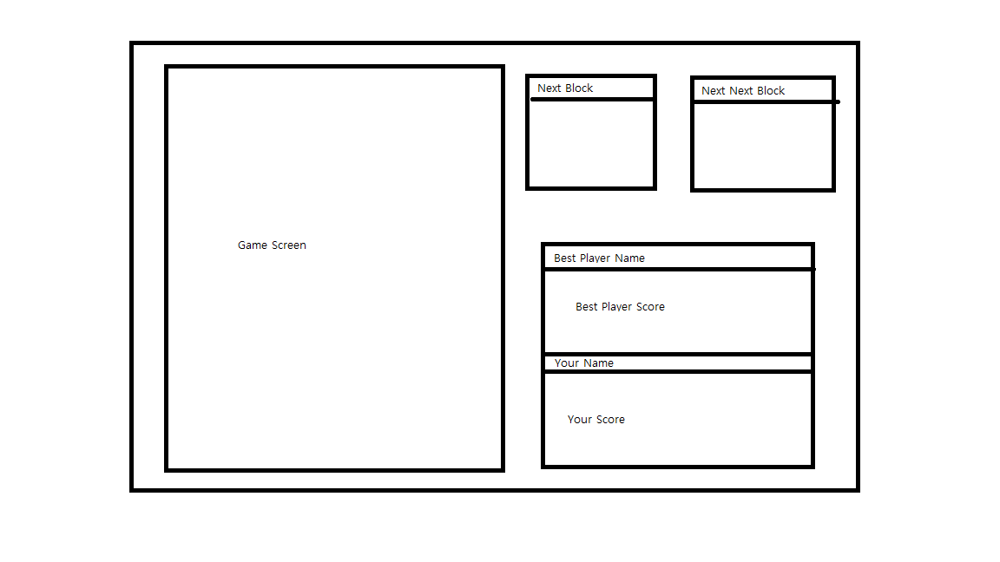

# Tetris_Consol Project Document
## ● 개요
    C#의 기본적인 문법과 BCL의 활용을 통해 C#을 공부하기 위해서 하는 프로젝트로, 콘솔상에서 테트리스 게임을 제작한다.

## ● 구현

### &nbsp;&nbsp;1. 기본적인 UI
#### &nbsp;&nbsp;&nbsp;&nbsp;(1) UI 샘플

#### &nbsp;&nbsp;&nbsp;&nbsp;(2) UI 설명
    - Game Screen : 게임화면 출력
    - Next Block : 다음 블록 출력
    - Next Next Block : 다다음 블록 출력
    - Best Player Name : 최고점 유저명 출력
    - Best Player Score : 최고점 유저의 점수 출력
    - Your Name : 현재 유저명 출력
    - Your Score : 현재 유저 점수 출력

### &nbsp;&nbsp;2. 조작키
    - Direction key : 블록 조각을 조작한다. / 메뉴 이동
    - Space Bar : 블록을 바로 떨어뜨린다.
    - p : 일시정지 / 일시정지 해제
    - Enter : 메뉴 선택

### &nbsp;&nbsp;3. 진행방식
    1. 프로그램 실행시 유저명을 입력 받는다.
    2. 게임 실행 여부를 물음 y/n?
    3. GameOver
    4. 게임이 종료되고 다시 할 것인지 물어봄 y/n?
    5. 게임 종료

### &nbsp;&nbsp;4. 게임 데이터베이스
    플레이 했던 유저 중에서 가장 점수가 높았던 플레이어의 점수와 유저명을 저장한다.

